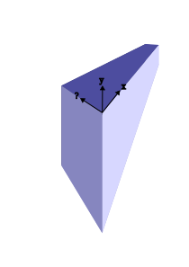

---
jupytext:
  formats: md:myst
  text_representation:
    extension: .md
    format_name: myst
    format_version: 0.13
    jupytext_version: 1.17.1
---

# Basic equations

We generally consider water motion resulting in plane waves in one dimension (1D) within the Euler approach. By 'water', we mean an incompressible fluid with zero viscosity. By 1D waves, we mean surface waves travelling in a direction $x$. The height profile is in the direction $y$. In the 'real' world there is a third dimension, that we don't care about here, and labelled with $?$. Normally this third dimension would be labelled $z$, or whatever, but we will want to use this character for something else . . . The motion we will consider will be independent of this third dimension.

## Continuity and vorticity

We start with the simplest aspect: the continuity equation:

$$\frac{\partial\rho}{\partial t}+\mathbf{\nabla} \cdot \rho\mathbf{v}=0$$

But incompressibility means that the mass density $\rho$ is constant on its 'journey through time and space'. Thus:

$$\mathbf{\nabla} \cdot \mathbf{v}=0$$

A further differential constraint on the velocity $\mathbf{v}$ is that the vorticity is zero:

$$\mathbf{\nabla} \times \mathbf{v}=0$$

Why? The hand-waving argument references Kelvin's circulation theorem. We imagine the wave motion has been gradually built up from still water with zero viscosity, perhaps. Or is it that fluids with high vorticity tend towards low vorticity in the presence of dissipation (viscosity), which we are neglecting? This would be like the diffusion equation filtering out all but the slowest decaying terms.

Anyway, so far, so linear.

## Nonlinear boundary

We imagine our water is in a gravity field, and there is a boundary with a near-zero pressure fluid. We ignore surface tension. The water motion is drive by these two forces:

$$\frac{D\mathbf{v}}{Dt}=\frac{\partial\mathbf{v}}{\partial t}+\mathbf{v}\cdot\mathbf{\nabla}\mathbf{v}=-\mathbf{\nabla}\frac p\rho+\mathbf g$$

We can simplify this by two steps. First we travel with the wave so the profile is time independent. Thus $\partial\mathbf{v}/\partial t=0$. We also expand the vector differential operator:

$$\mathbf{v}\cdot\mathbf{\nabla}\mathbf{v}=(\mathbf{\nabla}\times\mathbf{v})\times\mathbf{v}+\frac12\nabla v^2$$

But the motion is irrotational (zero vorticity) so the first term on the right is zero. Combining the last two equations:

$$\frac12\nabla v^2+\mathbf{\nabla}\frac p\rho=\mathbf g$$

We can go further $\mathbf g=-\nabla (gy)$, given our coordinate system with the gravity force $g$ pointing to negative $y$. The pressure field is thus given by Bernoulli's principle:

$$\frac12 v^2+\frac p\rho+gy=\mathrm{const.}$$

derived from:

$$\mathbf{\nabla}\left(\frac12 v^2+\frac p\rho+gy\right)=0$$

The Bernoulli equation looks a lot like an energy conservation equation in gravity, except for the pressure. Imposing the constancy of the expression will enable the pressure at any point from the given constant and the velocity at the given point. Further the surface will have a pressure that equals that of the atmosphere. It will be near zero, and can be absorbed into overall constant. This, we hope, will be clearer when we delve into the details.